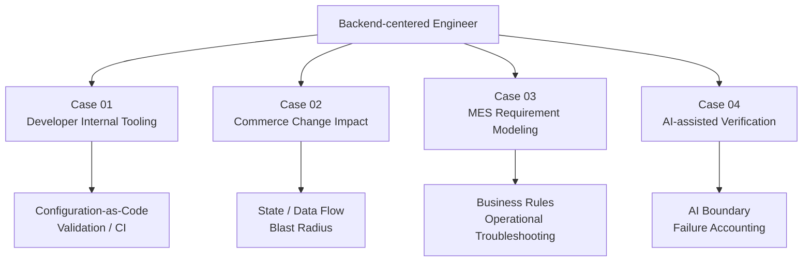
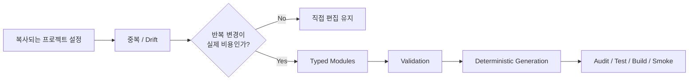
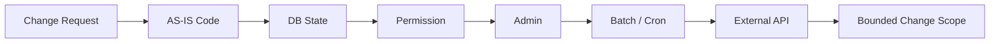
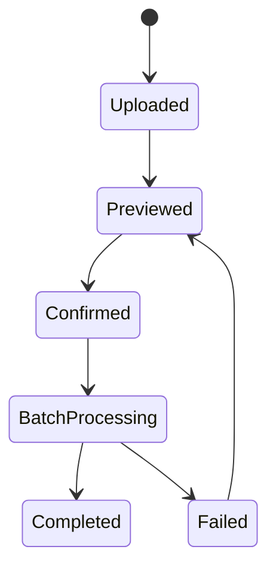
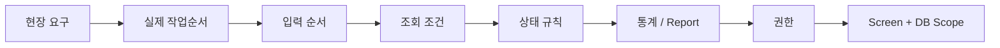
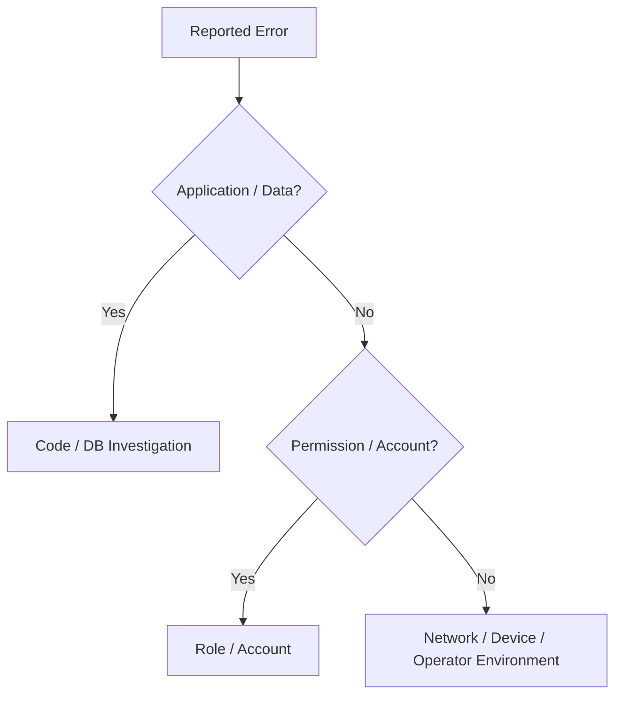
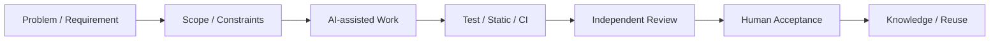
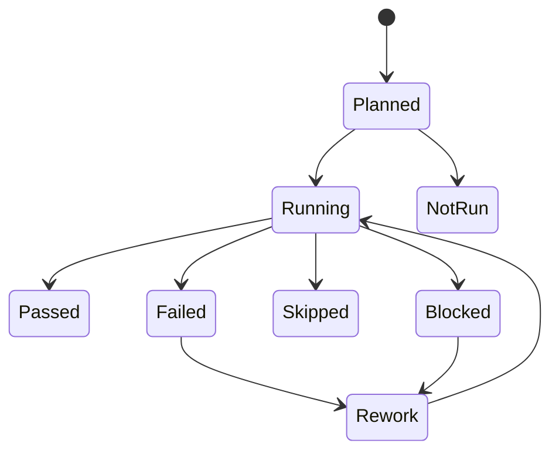
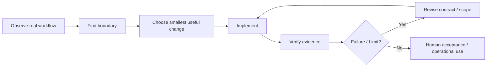

# Backend / Internal Tools / AX Portfolio

> `PS-v1.4.0` · **Case-study-first GitHub Portfolio** · 2026-08-19

## Backend Engineer | 업무시스템 · 내부도구 · AX/개발자동화

운영형 PHP/MySQL 업무시스템에서 **상태·권한·관리자·배치·외부 연동의 변경 영향**을 다뤄 왔고, 최근에는 반복되는 개발 문제를 **내부도구와 검증 가능한 AI-assisted workflow**로 구조화하고 있습니다.

이 페이지는 경력 연표를 다시 쓰는 이력서가 아닙니다. 아래 Case가 각각 **문제 → 판단 → 구현 → 검증 → 한계**를 보여줍니다.

[General Backend Portfolio](PORTFOLIO.md) · [Case Study Index](docs/portfolio-ax/README.md) · [Public Resume Variant](content/resume/variants/ax-internal-tools-ko.md)

---

# 30-Second Portfolio Map



| Case | 문제 | 핵심 판단 | 확인 가능한 증거 |
|---|---|---|---|
| **01. harness-kit** | 프로젝트별 AI 개발 설정의 중복과 drift | 모든 설정을 플랫폼화하지 않고 반복되는 경계만 typed module로 공통화 | public code + Node 22/24 security-gated CI |
| **02. Commerce / Logistics** | 화면 증상이 DB·관리자·batch·외부 API까지 연결 | 코드 수정 전 변경 blast radius부터 탐색 | sanitized career case + ready claim bank |
| **03. Manufacturing MES** | 모호한 현장 요구가 상태·조회·통계·권한 규칙을 숨김 | 요청 문구를 실제 업무순서와 system condition으로 분해 | sanitized career case + requirement model |
| **04. AI-assisted Engineering** | Agent의 `done`과 실제 검증 완료가 다를 수 있음 | model output과 completion evidence를 분리 | public workflow repos + test/CI/failure accounting |

---

# Case 01 — Developer Internal Tooling

## 반복 설정을 언제 도구로 바꿀 것인가?



**Decision**  
프로젝트 수가 적고 변경이 드물면 직접 편집이 더 단순합니다. 공통 규칙 변경과 drift가 반복될 때만 module/configuration-as-code를 사용합니다.

**Proof**  
첫 functional CI가 green이었지만 dependency high-severity 항목을 발견해 포트폴리오 승격을 중지했습니다. remediation 후 `npm audit --audit-level=high`를 hard gate로 추가하고 Node.js 22/24에서 **audit → typecheck → 36 tests → build → CLI smoke**를 merged `main`에서 다시 통과시켰습니다.

**Evidence**  
[harness-kit](https://github.com/tomtomjskim/harness-kit) · [Validation PR](https://github.com/tomtomjskim/harness-kit/pull/1) · [Case Deep Dive](docs/portfolio-ax/cases/01-harness-kit-internal-tooling.md)

---

# Case 02 — Commerce / Logistics Change Impact

## 한 화면의 변경은 정말 한 화면에서 끝나는가?



**Decision**  
증상이 보이는 UI부터 수정하지 않고, 이번 변경에 연결된 상태와 후속 처리의 범위를 먼저 찾습니다.

**Representative flow**



**Portfolio signal**  
레거시 PHP 운영 시스템에서 DB 상태·권한·관리자·background work·외부 연동을 **한 변경의 blast radius**로 보는 방식입니다.

**Evidence**  
[Case Deep Dive](docs/portfolio-ax/cases/02-commerce-change-impact.md) · [Sanitized Career Source](content/projects/commerce-fulfillment-operations.md)

---

# Case 03 — MES Requirement Modeling

## “화면을 바꿔 주세요”를 무엇으로 번역할 것인가?



**Decision**  
화면 요청을 UI task로만 보지 않고, 실제 작업순서와 상태·조회·권한·집계 규칙으로 분해합니다.

**Troubleshooting boundary**



**Portfolio signal**  
현업 언어를 system condition으로 바꾸는 모델링과, application defect와 고객 환경 문제를 구분하는 운영 troubleshooting입니다.

**Evidence**  
[Case Deep Dive](docs/portfolio-ax/cases/03-mes-requirement-modeling.md) · [Sanitized Career Source](content/projects/manufacturing-mes-business-systems.md)

---

# Case 04 — AI-assisted Engineering

## Agent가 `done`이라고 하면 완료인가?



**Decision**

```text
Model response != Completion evidence
```

AI는 분석·구현·리뷰 후보를 만드는 participant로 사용하고, 상태·금액·권한의 최종 결정이나 검증 없는 production write를 기본 책임으로 주지 않습니다.

**Failure accounting**



**Proof**  
공개 workflow에서는 pass, skip, failure, `not_run`을 분리하고 실행하지 않은 live/external path를 성공으로 승격하지 않습니다.

**Evidence**  
[Case Deep Dive](docs/portfolio-ax/cases/04-ai-assisted-verification.md) · [Codex Workflow Skills](https://github.com/tomtomjskim/codex-workflow-skills) · [StackForge Atlas](https://github.com/tomtomjskim/stackforge-atlas)

---

# What Connects the Four Cases



제가 포트폴리오에서 보여주려는 공통 역량은 특정 framework 숙련도보다 다음입니다.

- **업무와 상태를 먼저 이해**하고,
- 변경 경계를 명확히 만들고,
- 과한 abstraction은 피하며,
- 실제 실행 증거로 검증하고,
- 증명하지 못한 범위는 한계로 남기는 것.

---

# Public Repository Index

| Repository | 열어볼 이유 | Verification | 명시적 한계 |
|---|---|---|---|
| [harness-kit](https://github.com/tomtomjskim/harness-kit) | developer internal tooling, typed config, deterministic generation | Node 22/24 audit + typecheck + 36 tests + build + CLI smoke | production adoption / productivity claim 없음 |
| [codex-workflow-skills](https://github.com/tomtomjskim/codex-workflow-skills) | intake/review/validation/failure accounting contract | public forward-test + GitHub Actions | external/live path 일부 `not_run`/skip |
| [stackforge-atlas](https://github.com/tomtomjskim/stackforge-atlas) | intent→interface→evidence→recovery 연결 | Node/PostgreSQL pilots + recovery drill + CI | PITR/HA/failover proof 아님 |

Repository는 기술 로고를 보여주기 위한 링크가 아니라 **각 Case의 판단·구현·검증을 직접 확인하는 Evidence**입니다.

---

# Evidence Boundary

이 포트폴리오는 다음을 의도적으로 주장하지 않습니다.

- `AI Engineer / ML Engineer` 경력
- company-wide AX platform ownership
- production RAG / inference serving
- frontend-specialist depth
- 측정하지 않은 생산성·매출·성능 개선률
- 공개할 수 없는 고객·주문·생산·결제 데이터 또는 production architecture

Public career cases는 비식별화한 문제 해결 모델이고, 공개 R&D repository는 현재 engineering capability의 증거입니다. 두 종류를 서로 바꿔 말하지 않습니다.

---

# Read Next

1. **Internal Tools / AX 역할:** 이 페이지 → [Case 01](docs/portfolio-ax/cases/01-harness-kit-internal-tooling.md) → [Case 04](docs/portfolio-ax/cases/04-ai-assisted-verification.md)
2. **Backend / Operations 역할:** [General Backend Portfolio](PORTFOLIO.md) → [Case 02](docs/portfolio-ax/cases/02-commerce-change-impact.md) → [Case 03](docs/portfolio-ax/cases/03-mes-requirement-modeling.md)
3. **Version comparison:** [PS-v1.3.0 text-heavy baseline](docs/portfolio-ax/versions/PS-v1.3.0-text-heavy-baseline.md) → current `PS-v1.4.0`

**Resume는 경력과 사실을 요약하고, 이 포트폴리오는 그 사실 뒤의 문제 해결 방식을 증명합니다.**
