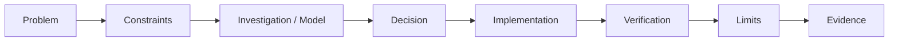

# AX / Internal Tools Portfolio — Case Study Index

> Strategy: `PS-v1.4.0`
> Surface: GitHub-first case-study portfolio
> Status: draft on `agent/portfolio-ax-case-study-v2`

## Why this directory exists

`PORTFOLIO-AX.md` is a **portfolio**, not an expanded resume.

The portfolio must answer:

```text
What problem existed?
→ What constraints mattered?
→ How was the problem decomposed?
→ What decision was made?
→ How was it implemented?
→ How was it verified?
→ What remains unproven?
→ Where can a reviewer inspect evidence?
```

Chronology, contact information, education, and exhaustive technology lists belong in the resume. They are intentionally secondary here.

## Portfolio Gate

A case fails the portfolio gate when most of its content is:

- company chronology,
- role/technology enumeration,
- generic capability claims,
- long prose without an inspectable model,
- repository links without explaining why they matter.

A case passes when it contains all of the following:

1. **Problem** — a concrete engineering or operational friction.
2. **Context / Constraints** — why the obvious solution is not enough.
3. **Decision** — what was selected and what was intentionally not selected.
4. **Visual Model** — architecture, state, sequence, or decision diagram.
5. **Implementation Boundary** — what is actually demonstrated.
6. **Verification** — test, CI, failure accounting, rollout feedback, or source-bounded evidence.
7. **Limitation** — what the evidence does not prove.
8. **Evidence Link** — public repository or sanitized case source.

## Selected Cases

| Case | Main question it answers | Evidence type |
|---|---|---|
| [01. harness-kit](cases/01-harness-kit-internal-tooling.md) | Can repeated developer friction be turned into a maintainable internal tool? | public repository + merged-main CI |
| [02. Commerce / Logistics](cases/02-commerce-change-impact.md) | How are changes made safely in a state-heavy operational system? | sanitized career case + ready claim bank |
| [03. Manufacturing MES](cases/03-mes-requirement-modeling.md) | How is an ambiguous field request converted into explicit system rules? | sanitized career case + source-bounded model |
| [04. AI-assisted Engineering](cases/04-ai-assisted-verification.md) | How is AI used without treating model output as completion evidence? | public repositories + workflow validation |

## Case Grammar

Every deep dive uses the same reading order.



This common grammar is intentional: interviewers should not have to relearn how to read each project.

## Versioning

The previous AX portfolio is preserved under [`versions/PS-v1.3.0-text-heavy-baseline.md`](versions/PS-v1.3.0-text-heavy-baseline.md).

### `PS-v1.3.0`

- correct target positioning,
- correct evidence ordering,
- but too much resume-like prose and capability enumeration.

### `PS-v1.4.0`

- case-study-first,
- diagrams before long explanation,
- verification and limitation attached to every promoted case,
- resume chronology removed from the main technical narrative,
- GitHub repositories linked as evidence rather than used as the story itself.

## Canonical Entry

The hiring-facing entry remains:

- [`/PORTFOLIO-AX.md`](../../PORTFOLIO-AX.md)

The files in `cases/` are deep dives reached from that index.
