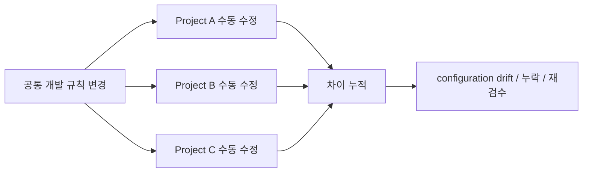
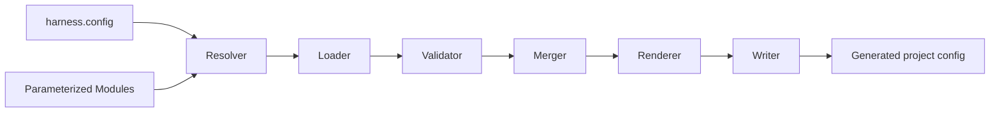
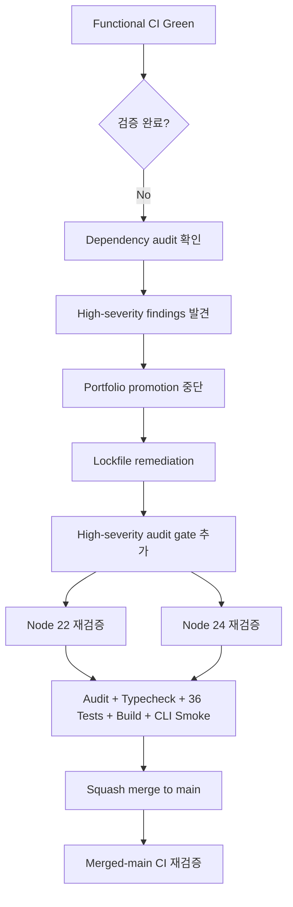

# Case 01 — harness-kit: Developer Internal Tooling

> **Question:** 반복되는 개발자 설정 문제를 언제, 어떻게 내부도구로 전환할 것인가?
>
> Evidence type: public R&D repository + merged-main CI

[Repository](https://github.com/tomtomjskim/harness-kit) · [Validation PR #1](https://github.com/tomtomjskim/harness-kit/pull/1)

---

## 1. Problem

프로젝트가 늘어나면서 AI coding 환경의 instruction, hooks, permissions, MCP, agents, workflow 설정을 프로젝트마다 직접 복사·수정하면 공통 규칙이 여러 곳으로 분산됩니다.



핵심 문제는 파일 복사 자체가 아니라 **변경점이 여러 프로젝트에서 서로 다르게 누적되는 것**입니다.

---

## 2. Constraint — 도구가 항상 정답은 아니다

작은 프로젝트까지 무조건 추상화하면 관리 대상만 하나 더 생깁니다.

| 상황 | 선택 |
|---|---|
| 프로젝트 1~2개, 규칙 변경 드묾 | 직접 편집이 더 단순 |
| 동일 설정을 반복 복사 | 템플릿이 유효 |
| 공통 규칙 + 프로젝트별 차이 + 반복 변경 | module/configuration-as-code 가치 증가 |

따라서 목표를 `모든 설정 자동화`가 아니라 **drift가 반복되는 경계만 공통화**하는 것으로 제한했습니다.

---

## 3. Decision

프로젝트 설정을 **typed module + deterministic build pipeline**으로 관리합니다.



### Why

- 공통 규칙은 module에 한 번 정의
- 프로젝트 차이는 parameter/config로 분리
- 잘못된 설정은 생성 전에 validation
- merge/render 결과는 사람이 수동으로 합치는 것보다 재현 가능하게 유지

### Not selected

- 거대한 중앙 orchestration platform
- 모든 프로젝트에 강제 도입
- LLM이 설정 충돌을 매번 자유롭게 해결하는 구조

---

## 4. Implementation Boundary

현재 공개 구현에서 확인 가능한 부분:

```text
TypeScript CLI
+ Zod schema validation
+ resolver / loader / validator
+ merger / renderer / writer
+ module installation
+ project profile composition
+ unit tests
```

이 프로젝트는 이전 회사의 production platform이 아니라 **현재 internal-tooling 설계·구현 방식을 공개적으로 검토할 수 있는 R&D artifact**입니다.

---

## 5. Verification — 첫 Green을 승인하지 않은 이유

처음 추가한 CI에서는 typecheck, 36 tests, build가 성공했습니다.

그런데 dependency 상태까지 검수하자 high-severity 항목이 남아 있었습니다.



### Final merged-main gate

```text
Node.js 22 / 24
npm ci
npm audit --audit-level=high
npm run lint
npm test              # 36 tests
npm run build
node dist/cli.js --help
```

두 Node 버전에서 모두 성공했습니다.

이 과정에서 중요한 증거는 `테스트가 많다`가 아니라:

> **새로운 리스크가 발견되면 기존 Green 상태를 완료로 고정하지 않고 validation contract 자체를 확장했다는 것**입니다.

---

## 6. Trade-off / Limitation

현재 이 Case가 증명하는 것:

- 반복 developer configuration을 도구로 구조화하는 능력
- typed validation / deterministic generation
- test와 dependency audit을 포함한 현재 공개 검증
- abstraction이 불필요한 조건을 명시하는 판단

증명하지 않는 것:

- 조직 전체 adoption
- npm ecosystem 사용량
- 생산성 N% 향상
- enterprise configuration platform 운영

Known limitation:

- low-severity dev-tool advisory는 high gate와 구분해 residual risk로 관리

---

## 7. Evidence

- Repository: https://github.com/tomtomjskim/harness-kit
- Validation PR: https://github.com/tomtomjskim/harness-kit/pull/1
- Merged validation commit: `c35136f562723f9c9af3945536ce3123c6f9bfc2`

### Interview hook

> 테스트가 통과한 뒤에도 왜 포트폴리오 승격을 멈췄고, 어떤 기준으로 security gate를 추가했는가?

이 질문이 이 Case의 핵심입니다.
