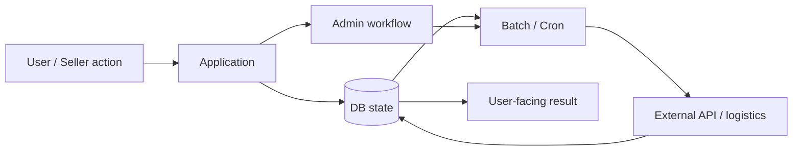
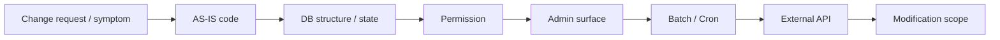
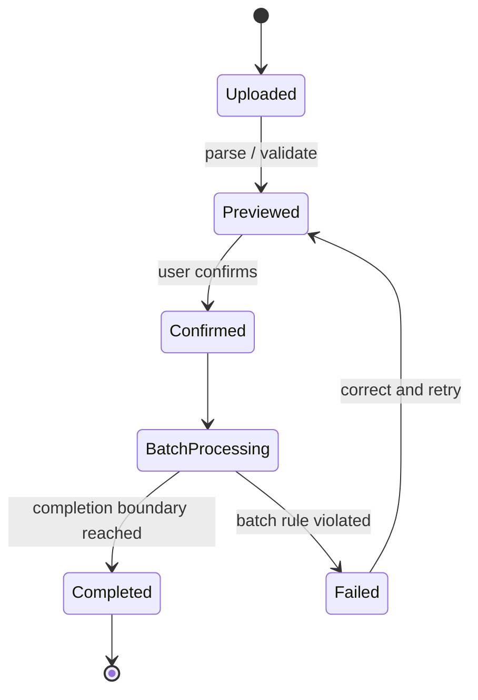
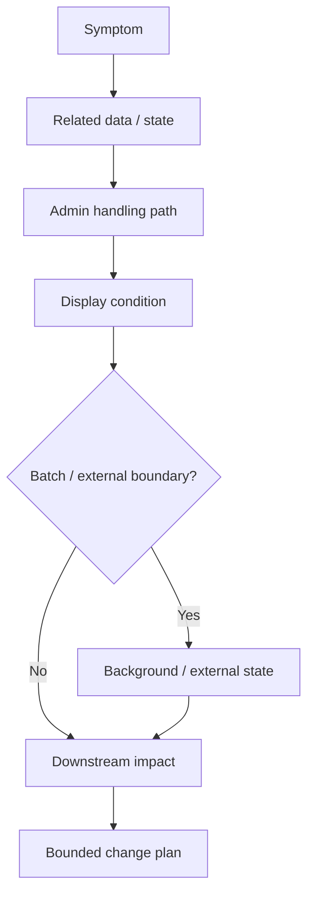

# Case 02 — Commerce / Logistics: Change Impact in a State-Heavy System

> **Question:** 화면 하나의 변경처럼 보이는 요청이 DB·관리자·배치·외부 API까지 연결될 때, 수정 범위를 어떻게 결정하는가?
>
> Evidence type: sanitized career case + public claim bank `CL-PUB-003 / 004 / 011`

[Sanitized source case](../../../content/projects/commerce-fulfillment-operations.md)

---

## 1. Problem

커머스·물류 운영 시스템에서 사용자에게 보이는 상태는 단일 화면이나 단일 테이블만으로 결정되지 않을 수 있습니다.



따라서 `화면에서 값이 이상하다`는 증상에 화면 조건만 수정하면 후속 처리와 상태가 더 어긋날 수 있습니다.

---

## 2. Context / Constraints

공개 가능한 범위의 핵심 맥락은 다음입니다.

- 장기간 운영된 PHP 업무시스템
- 상품·입고·재고·외부출고·관리자 대시보드 등 상태 중심 기능
- file-based 외부 주문 등록의 `upload → preview → confirm` 단계
- batch/cron과 외부 시스템 경계
- production 데이터와 실제 architecture는 비공개

즉, clean-slate 설계보다 **기존 동작을 보존하면서 blast radius를 먼저 찾는 것**이 중요했습니다.

---

## 3. Decision — 변경 전에 경계를 먼저 탐색

기능 변경 요청을 곧바로 코드 수정으로 번역하지 않습니다.



이 방식의 목적은 모든 시스템을 완벽히 분석하는 것이 아니라, **이번 변경에 연결된 경계가 어디까지인지 먼저 확인하는 것**입니다.

### Practical questions

```text
이 값의 source of truth는 어디인가?
누가 상태를 변경할 수 있는가?
관리자 처리와 사용자 화면은 같은 조건을 보는가?
비동기/배치가 뒤에서 다시 상태를 바꾸는가?
외부 시스템의 응답이 내부 상태에 영향을 주는가?
```

---

## 4. Batch Example — Upload / Preview / Confirm

외부 주문 등록처럼 여러 건을 한 번에 처리하는 기능에서는 `업로드 성공`과 `업무 반영 완료`를 분리해야 합니다.



이 구조는 사용자가 데이터를 검토할 수 있는 지점을 만들고, batch 처리의 완료 경계를 명시적으로 다룰 수 있게 합니다.

공개 portfolio에서는 이 흐름의 경험만 주장하며 특정 production transaction/idempotency architecture 전체를 소유했다고 확대하지 않습니다.

---

## 5. Investigation Model — 상태 불일치가 의심될 때

구체적인 proprietary incident chronology를 공개하는 대신, 문제를 보는 모델을 공개합니다.



이 모델의 핵심은 **증상 → 원인 후보 → 후속 영향**을 분리하는 것입니다.

---

## 6. What This Case Demonstrates

- PHP 기반 commerce/logistics 업무시스템 경험
- 상태와 후속 처리의 영향 범위를 먼저 보는 working method
- 관리자·권한·batch·외부 API를 변경 범위에 포함하는 판단
- upload / preview / confirm과 batch completion boundary 경험
- 실제 production 정보를 공개하지 않으면서도 문제 해결 방식을 설명하는 redaction discipline

---

## 7. What It Does Not Prove

다음은 이 public Case에서 주장하지 않습니다.

- 전체 commerce architecture ownership
- canonical order model 전체 설계
- idempotency / signed API / reconciliation 전체 ownership
- production SLA / 트래픽 / 매출 개선 수치
- 고객·주문·결제·배송 raw data

이 경계는 포트폴리오의 약점 숨기기가 아니라 **증명할 수 있는 범위와 없는 범위를 구분하기 위한 것**입니다.

---

## 8. Evidence

- Sanitized case: [`content/projects/commerce-fulfillment-operations.md`](../../../content/projects/commerce-fulfillment-operations.md)
- Public claim authority: [`docs/resume-data/public-claim-bank.md`](../../resume-data/public-claim-bank.md)

### Interview hook

> 레거시 운영 시스템에서 기능 하나를 바꿀 때 어디까지 확인해야 하는지를 어떻게 결정합니까?

이 질문에 답하기 위한 Case입니다.
