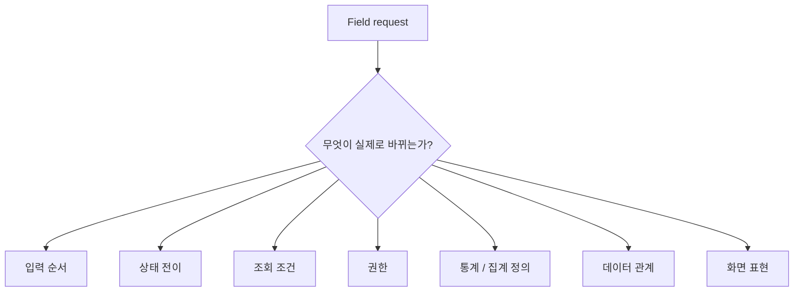
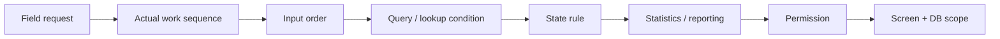
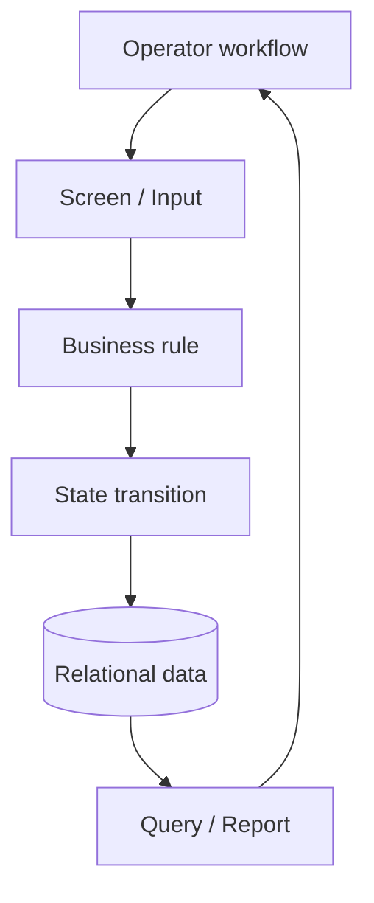
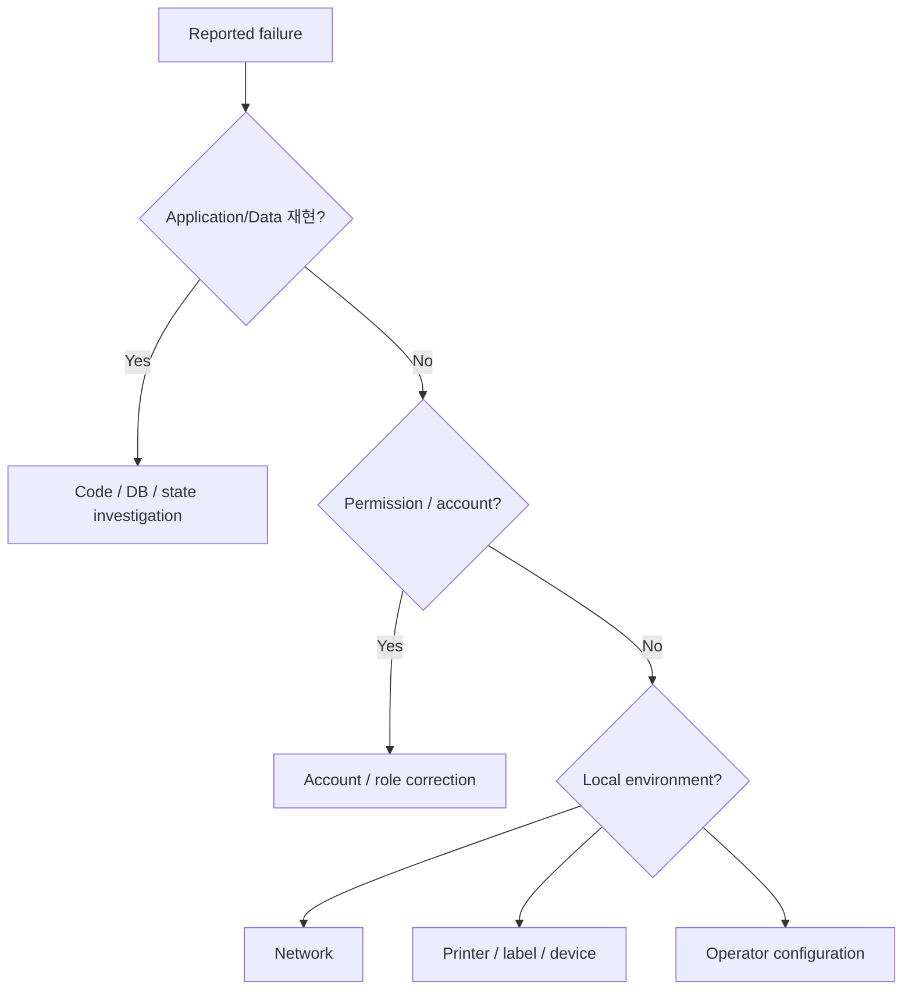
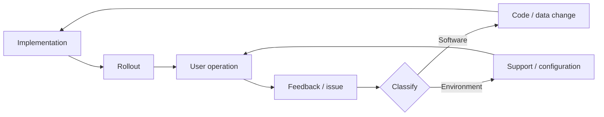

# Case 03 — Manufacturing MES: Field Request → System Rules

> **Question:** 현장에서 들어온 모호한 요구사항을 어떻게 DB·상태·권한·화면 규칙으로 바꾸는가?
>
> Evidence type: sanitized career case + protected-source-bounded public model

[Sanitized source case](../../../content/projects/manufacturing-mes-business-systems.md)

---

## 1. Problem

MES의 요청은 종종 화면 문장 하나로 들어오지만 실제 변경 범위는 업무 순서와 데이터 정의까지 포함합니다.

예를 들어 `생산 화면을 바꿔 주세요`라는 요구는 다음 중 무엇이 문제인지 먼저 구분해야 합니다.



요구 문구를 그대로 구현하면 화면은 맞아 보이지만 실제 작업 흐름과 데이터가 어긋날 수 있습니다.

---

## 2. Context — Software가 물리 업무와 붙어 있음

제조 시스템은 실제 작업 순서와 가까이 연결됩니다.


즉 화면 변경은 다음 질문과 연결될 수 있습니다.

- 어떤 상태에서 입력할 수 있는가?
- 이전 공정이 끝나지 않았는데 다음 처리가 가능한가?
- 조회 기준일과 집계 기준일은 같은가?
- 불량/재고 처리가 생산실적과 어떤 관계인가?
- 누가 수정 또는 확정할 수 있는가?

---

## 3. Decision — 요구사항을 시스템 조건으로 분해

모호한 요청을 구현 티켓으로 바로 넘기지 않고 업무 규칙으로 분해합니다.



### Why

이 분해를 하면 `UI 수정`처럼 보인 요청이 실제로는:

- 상태 정의 문제인지,
- 조회조건 문제인지,
- 데이터 저장 문제인지,
- 권한 문제인지

를 구분할 수 있습니다.

---

## 4. Implementation Model — 화면과 DB를 따로 보지 않음



이 Case에서 중요한 것은 특정 framework보다 **현업 workflow와 system state를 맞추는 모델링**입니다.

공개 가능한 career evidence는 PHP 기반 MES/business-system 개발·유지보수와 제조 생산관리 도메인 경험입니다. 상세 고객/공장 정보나 production data는 공개하지 않습니다.

---

## 5. Troubleshooting — 시스템 문제와 환경 문제 분리

고객/현장 환경에서는 `시스템이 안 됩니다`가 반드시 application bug를 의미하지 않습니다.



코드를 먼저 수정하기 전에 **어느 계층에서 문제가 발생했는지**를 찾는 것이 중요합니다.

---

## 6. Feedback Loop — 구현이 끝이 아님

현장 도입과 사용 피드백은 다음 요구사항의 입력이 됩니다.



이 loop를 통해 `요구사항 문서에 없었던 실제 사용 조건`을 다시 발견할 수 있습니다.

---

## 7. Trade-off — Rewrite보다 Incremental Change

장기 운영 PHP 시스템에서 항상 이상적인 architecture rewrite가 가능한 것은 아닙니다.

```text
기존 동작 이해
→ code/data 관계 확인
→ 불안정하거나 중복된 경계 식별
→ 작은 변경으로 격리
→ 기존 업무 동작 보존
→ 필요한 부분만 구조 개선
```

이 포트폴리오는 완전한 현대화나 전체 architecture ownership을 주장하지 않습니다.

---

## 8. What This Case Demonstrates

- 현업 요구를 시스템 조건으로 분해하는 사고
- 상태/데이터/조회/권한/통계 관계를 함께 보는 방식
- application/data와 local environment 문제를 분리하는 troubleshooting
- rollout/support feedback을 다음 개선의 입력으로 사용하는 관점
- legacy business system에서 incremental change를 선택하는 판단

---

## 9. What It Does Not Prove

- 전체 MES 제품 ownership
- 모든 고객사 architecture가 동일했다는 주장
- 공개할 수 없는 공장/생산 데이터
- cloud-native SaaS 경험으로의 과장
- 정량 성과나 SLA

---

## 10. Evidence

- Sanitized case: [`content/projects/manufacturing-mes-business-systems.md`](../../../content/projects/manufacturing-mes-business-systems.md)
- Public claim authority: [`docs/resume-data/public-claim-bank.md`](../../resume-data/public-claim-bank.md)

### Interview hook

> 현업이 “화면을 바꿔 달라”고 했을 때, 실제 구현 조건을 어떤 질문으로 좁혀 갑니까?

이 질문에 답하기 위한 Case입니다.
