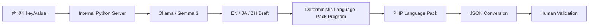
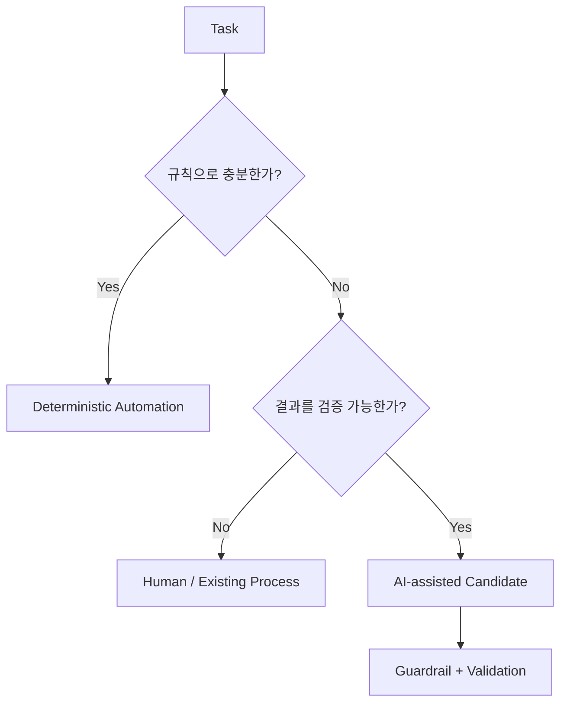
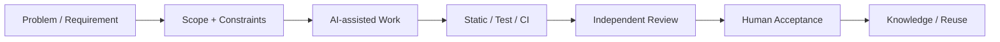
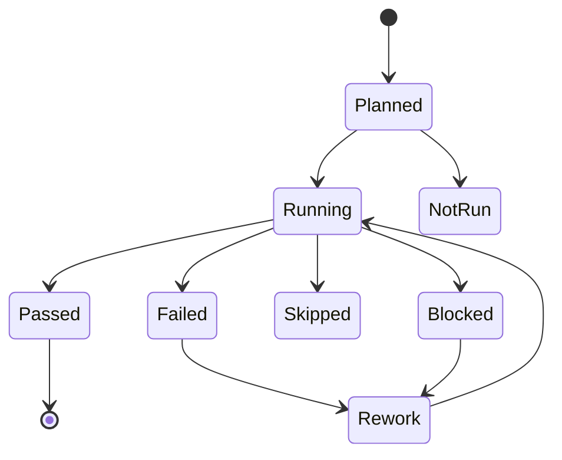
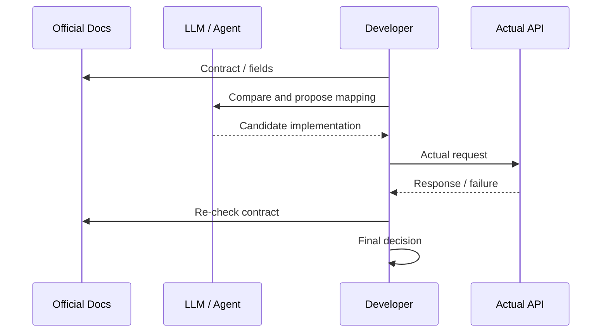

# Case 04 — Practical AI Automation: Local LLM + Verification Boundary

> **Question:** AI를 쓸 수 있는 업무라고 해서 전부 AI에 맡겨야 하는가? 자연어 처리, 결정론적 변환, 사람 검수를 어디서 나눌 것인가?
>
> Evidence type: actual sanitized work automation + public workflow/verification repositories

[Local LLM i18n](../../../content/projects/local-llm-i18n-workflow.md) · [AI-assisted Workflow](../../../content/projects/ai-assisted-development-workflow.md) · [Codex Workflow Skills](https://github.com/tomtomjskim/codex-workflow-skills) · [StackForge Atlas](https://github.com/tomtomjskim/stackforge-atlas)

---

## 1. Problem — 반복 번역 업무가 개발 흐름을 끊음

다국어 UI 언어팩을 만들 때 자연어 번역뿐 아니라 번역기 실행, 결과 복사, 코드 입력, PHP/JSON 변환까지 반복 작업이 이어졌습니다.

```text
한국어 문장 확인
→ 언어별 번역기 실행
→ 번역 결과 복사
→ 코드 입력
→ 언어별 반복
→ PHP / JSON 언어팩 반영
```

문제는 번역 품질만이 아니라 **사람이 동일한 조작을 계속 반복해야 한다는 것**이었습니다.

---

## 2. Constraints — 내부 환경과 작은 모델

실행 환경에는 전용 GPU가 없었고 내부 개발 PC에서 로컬 inference를 사용했습니다.

제약:

- CPU 기반 inference라 throughput이 높지 않음
- Gemma 3 계열 소형 모델이라 문맥/번역 품질 한계 존재
- 완전 자동 번역 품질을 보장할 수 없음
- 내부 개발 환경이라 외부 SaaS를 기본값으로 두지 않음

따라서 목표를 `사람 없는 완전 자동화`로 잡지 않았습니다.

---

## 3. Decision — AI가 필요한 부분만 AI에 맡김

핵심 판단은 **자연어 처리와 파일 변환을 같은 문제로 취급하지 않는 것**입니다.



### LLM responsibility

- 자연어 번역 초안
- 규칙만으로 처리하기 어려운 linguistic transformation

### Deterministic program responsibility

- key/value 구조 보존
- PHP language-pack 생성
- JSON 변환
- 입력/출력이 명확한 file transformation

### Human responsibility

- 번역 맥락 확인
- 소형 모델 오역 검수
- 최종 반영 판단

이 분리를 통해 **LLM이 잘하는 부분과 일반 코드가 더 안전한 부분을 섞지 않았습니다.**

---

## 4. Result — 실제 workflow에 들어간 수준

이 자동화는 단순 demo가 아니라 프론트 개발자가 실제 언어팩 작업에서 반복 사용했습니다.

변화:

```text
Before
번역기 실행 → 복사 → 코드입력 → 반복

After
로컬 번역 초안 생성
→ 다른 개발 작업 병행 가능
→ deterministic converter
→ 사람 검수 / 반영
```

다만 다음 수치는 측정하지 않았기 때문에 주장하지 않습니다.

- 생산성 향상률
- 정확도 %
- 비용 절감률
- 처리량 benchmark

실제 사용 사실과 정량 성과는 구분합니다.

---

## 5. General Decision Rule — AI vs Normal Automation

이 사례에서 얻은 기준을 일반화하면 다음과 같습니다.

| 문제 특성 | 기본 선택 |
|---|---|
| 동일 입력 → 명확한 동일 출력 | normal code / deterministic script |
| 파일 포맷·상태·금액·권한 | deterministic rule 우선 |
| 자연어·분류·요약·초안 | AI candidate 가능 |
| 결과를 사람이 쉽게 검증 가능 | AI 활용 가치 증가 |
| 틀리면 즉시 production write 발생 | AI 직접 실행 최소화 |



핵심 질문은 `AI를 넣을 수 있는가?`가 아니라:

> **AI가 필요한가, 잘못됐을 때 어떻게 발견하고 누가 최종 판단하는가?**

---

## 6. Verification Boundary — Model Output Is Not Evidence

코딩 Agent와 LLM workflow에서도 같은 원칙을 적용합니다.

```text
Model response
!=
Completion evidence
```



AI는 분석·구현·리뷰 후보를 만들 수 있지만 **설계 책임과 완료 판정의 source of truth는 실행 근거와 사람 판단**에 둡니다.

---

## 7. Failure Accounting — PASS 하나로 뭉개지 않음

검증 상태를 구분합니다.



`외부 환경이 없어 실행하지 못함`과 `실제로 통과함`은 다른 정보입니다.

`codex-workflow-skills`의 공개 forward-test 예시:

- 881 tests discovered
- 879 pass
- 2 external-environment skip
- prerequisite가 없는 live/paid path는 `not_run`

숫자의 목적은 홍보가 아니라 **실행 범위를 숨기지 않는 것**입니다.

---

## 8. External API — LLM은 공식 문서 대체재가 아님



LLM은 비교·정리 속도를 높일 수 있지만 공식 계약과 실제 응답을 source of truth로 유지합니다.

---

## 9. Supporting Public Engineering Evidence

### Codex Workflow Skills

```text
Intake
→ Implementation
→ Independent Review
→ Validation
→ Session Closeout
```

보여주는 것:

- scope / approval boundary
- adversarial review
- failure accounting
- `not_run`과 pass 분리

Repository: https://github.com/tomtomjskim/codex-workflow-skills

### StackForge Atlas

```text
Intent
→ Interface
→ Implementation
→ Verification
→ Failure / Recovery
→ Evolution
```

보여주는 것:

- intent/interface/evidence 연결
- PostgreSQL durability/recovery exercise
- 증명하지 않은 PITR/HA/failover 범위의 명시적 제한

Repository: https://github.com/tomtomjskim/stackforge-atlas

### harness-kit

AI coding 환경의 반복 configuration을 typed module과 CI로 관리하는 별도 Case 01입니다.

Repository: https://github.com/tomtomjskim/harness-kit

---

## 10. What This Case Demonstrates

- 실제 반복 업무에서 local LLM을 적용한 경험
- AI와 deterministic program의 책임 분리
- 제한된 하드웨어를 전제로 한 practical architecture 판단
- 작은 모델의 한계를 인정하고 human validation을 유지한 운영 방식
- model output과 completion evidence를 분리하는 개발 workflow
- skip / not_run / failure를 pass와 구분하는 검증 discipline

---

## 11. What It Does Not Prove

- company-wide AX platform 운영
- production RAG / model serving ownership
- 모델 학습·fine-tuning 전문성
- GPU inference platform 운영
- 번역 정확도 보장
- AI 사용으로 생산성 N% 향상
- AI가 업무 정책이나 production deploy를 단독 결정

---

## 12. Evidence

- Practical work automation: [`Local LLM i18n Workflow`](../../../content/projects/local-llm-i18n-workflow.md)
- Sanitized engineering workflow: [`AI-assisted Development Workflow`](../../../content/projects/ai-assisted-development-workflow.md)
- Codex Workflow Skills: https://github.com/tomtomjskim/codex-workflow-skills
- StackForge Atlas: https://github.com/tomtomjskim/stackforge-atlas
- harness-kit: https://github.com/tomtomjskim/harness-kit

### Interview hooks

> 로컬 LLM 번역에서 왜 PHP/JSON 파일 생성·변환까지 LLM에 맡기지 않았습니까?

> Agent가 “완료했다”고 했을 때 무엇을 확인해야 실제 완료라고 판단합니까?

두 질문이 이 Case의 핵심입니다.
