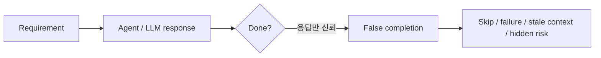
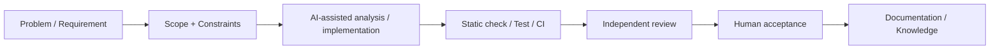
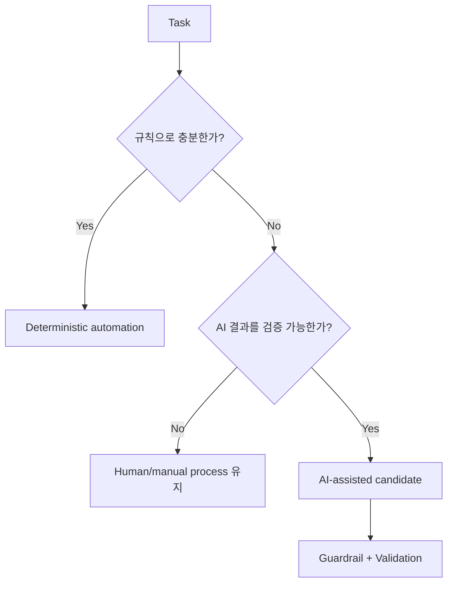
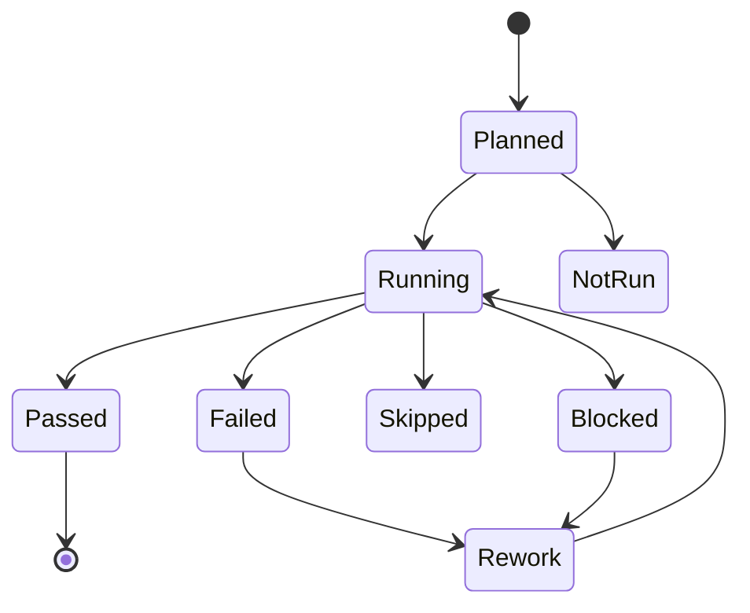
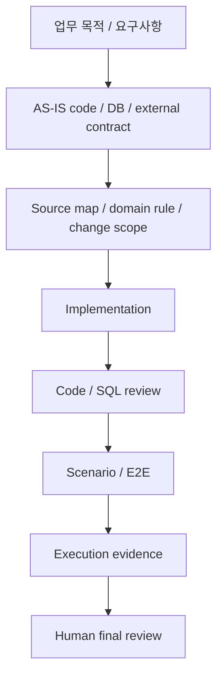
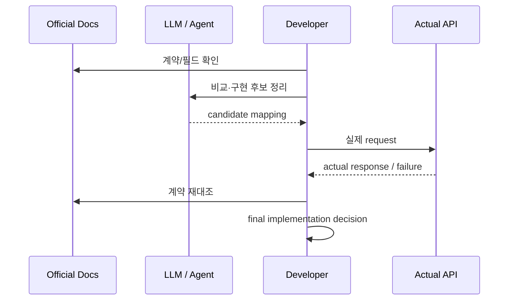
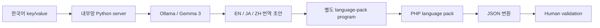

# Case 04 — AI-assisted Engineering: Model Output Is Not Evidence

> **Question:** AI를 개발 workflow에 넣되, 완료 판단과 책임을 어떻게 통제할 것인가?
>
> Evidence type: public repositories + workflow validation + sanitized operating pattern + practical local-LLM automation

[Workflow case](../../../content/projects/ai-assisted-development-workflow.md) · [Local LLM i18n](../../../content/projects/local-llm-i18n-workflow.md) · [Codex Workflow Skills](https://github.com/tomtomjskim/codex-workflow-skills) · [StackForge Atlas](https://github.com/tomtomjskim/stackforge-atlas)

---

## 1. Problem

AI-assisted 개발에서 가장 위험한 상태는 모델이 틀리는 것 자체보다 **수행하지 않은 작업을 완료로 받아들이는 것**입니다.



프로젝트가 복잡해질수록 다음 문제가 커집니다.

- scope drift
- stale context
- 테스트 skip / 미실행
- weak review
- 외부 API 문서의 잘못된 해석
- `완료했습니다`와 실제 검증 상태의 불일치

---

## 2. Decision — AI를 workflow의 일부로 제한

AI는 설계 책임자나 완료 판정자가 아니라 **분석·구현·리뷰 후보를 만드는 participant**로 둡니다.



핵심 경계:

```text
Model response
!=
Completion evidence
```

---

## 3. AI가 필요한가부터 판단

AI를 자동화의 기본값으로 사용하지 않습니다.

| 문제 특성 | 기본 선택 |
|---|---|
| 명확한 규칙, 동일 입력→동일 출력 | deterministic script / normal code |
| 금액·권한·상태 최종 결정 | deterministic rule + human/process control |
| 비정형 자연어, 요약·분류·초안 | AI candidate 가능 |
| 결과를 사람이 쉽게 검토 가능 | AI 활용 가치 증가 |
| 실패가 production write를 직접 유발 | AI 직접 실행 최소화 |

질문 순서는 다음입니다.



---

## 4. Failure Accounting — PASS 하나로 뭉개지 않음

검증 상태를 최소한 다음처럼 구분합니다.



### Why

`외부 환경이 없어서 실행 못함`과 `테스트가 통과함`은 같은 정보가 아닙니다.

`codex-workflow-skills`의 공개 forward-test에서는 repository-owned validation과 외부 환경 의존 상태를 분리합니다.

- 881 tests discovered
- 879 pass
- 2 external-environment skip
- prerequisite가 없는 live/paid path는 `not_run`

숫자의 목적은 홍보가 아니라 **실행한 것과 실행하지 않은 것을 분리하는 것**입니다.

---

## 5. Development Flow — 실제 프로젝트 맥락 유지

LLM 활용 범위를 코드 생성에만 두지 않고, 프로젝트 맥락과 검증 기준을 반복 가능한 형태로 남깁니다.



남기는 정보:

- 프로젝트 공통 규칙
- 코드 소스맵
- 도메인/기능 지식
- 외부 API 계약 분석
- PR/review 기준
- 반복 검수 checklist / skill
- 실행 결과 문서

---

## 6. External API Boundary

LLM은 공식 API 문서 대체재가 아닙니다.



즉 AI는 **검색·비교 속도**를 높일 수 있지만 source of truth를 대체하지 않습니다.

---

## 7. Practical Automation — Local LLM i18n

Workflow 원칙을 실제 반복 업무에 적용한 사례가 다국어 언어팩 작업입니다.

기존에는 한국어 UI 문장을 언어별 번역기에 넣고, 결과를 복사해 코드에 입력한 뒤 PHP/JSON 언어팩으로 반영하는 작업을 반복했습니다. 이 과정에서 **자연어 번역과 결정론적으로 처리할 수 있는 파일 변환을 분리**했습니다.



### Why this boundary

- **LLM:** 자연어 번역처럼 규칙만으로 해결하기 어려운 부분
- **일반 프로그램:** key/value 구조, PHP 파일 생성, JSON 변환처럼 입력·출력이 명확한 부분
- **사람:** 소형 모델의 오역과 화면 맥락을 최종 확인하는 부분

실행 환경은 전용 GPU가 없는 내부 PC였고 모델도 소형 Gemma 3 계열이었습니다. 문장 단위 처리에 시간이 걸리고 일부 번역은 다시 확인해야 했기 때문에 완전 자동화를 목표로 하지 않았습니다.

그럼에도 프론트 개발자가 실제 언어팩 업무에 반복 사용했고, 언어별 번역기 실행·복사·코드 입력을 계속 반복하던 작업을 **번역 초안 생성과 다른 개발 작업을 병행할 수 있는 흐름**으로 변경했습니다.

### What this example proves

- AI를 넣을 부분과 일반 코드로 처리할 부분을 분리한 판단
- 제한된 내부 환경에서 로컬 모델을 실제 반복 업무에 적용한 경험
- 모델 한계를 감안해 human validation을 유지한 운영 방식

### What it does not prove

- 번역 정확도 수치
- 생산성 향상률
- 완전 자동 번역
- 조직 전체 표준 도구화
- 대형 GPU inference 환경 운영

Detailed sanitized case: [`Local LLM i18n Workflow`](../../../content/projects/local-llm-i18n-workflow.md)

---

## 8. Public Engineering Evidence

### Codex Workflow Skills

```text
Intake
→ Implementation
→ Independent Review
→ Validation
→ Session Closeout
```

강점:

- scope / approval boundary
- adversarial review
- failure accounting
- `not_run`과 pass 분리

Repository: https://github.com/tomtomjskim/codex-workflow-skills

### StackForge Atlas

```text
Intent
→ Interface
→ Implementation
→ Verification
→ Failure / Recovery
→ Evolution
```

강점:

- 구현 속도보다 intent/interface/evidence 연결
- PostgreSQL durability/recovery exercise
- 증명하지 않은 PITR/HA/failover 범위 명시

Repository: https://github.com/tomtomjskim/stackforge-atlas

### harness-kit

AI coding environment의 반복 설정을 typed configuration과 CI로 관리하는 Case 01의 직접 증거입니다.

Repository: https://github.com/tomtomjskim/harness-kit

---

## 9. What This Case Demonstrates

- AI를 일반 automation과 구분하는 판단 기준
- model output과 completion evidence를 분리하는 방식
- static/test/CI/independent review/human acceptance 경계
- skip / not_run / failure를 숨기지 않는 검증 discipline
- 프로젝트 context를 재사용 가능한 규칙·문서·skill로 구조화하는 방법
- 로컬 LLM과 deterministic program을 실제 업무 특성에 맞게 조합하는 방식

---

## 10. What It Does Not Prove

- company-wide AX platform 운영
- production RAG / model serving ownership
- 모델 학습 전문성
- AI 사용으로 생산성 N% 향상
- AI가 업무 정책이나 production deploy를 단독 결정

---

## 11. Evidence

- Sanitized career workflow: [`content/projects/ai-assisted-development-workflow.md`](../../../content/projects/ai-assisted-development-workflow.md)
- Local LLM practical automation: [`content/projects/local-llm-i18n-workflow.md`](../../../content/projects/local-llm-i18n-workflow.md)
- Codex Workflow Skills: https://github.com/tomtomjskim/codex-workflow-skills
- StackForge Atlas: https://github.com/tomtomjskim/stackforge-atlas
- harness-kit: https://github.com/tomtomjskim/harness-kit

### Interview hooks

> Agent가 “완료했다”고 했을 때 무엇을 확인해야 실제 완료라고 판단합니까?

> 로컬 LLM 번역에서 왜 파일 생성·변환까지 LLM에 맡기지 않았습니까?

두 질문이 이 Case의 핵심입니다.
